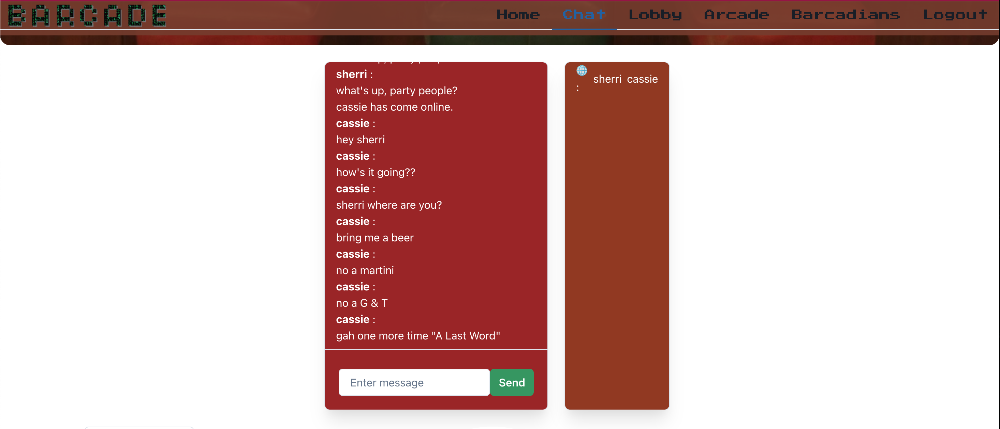
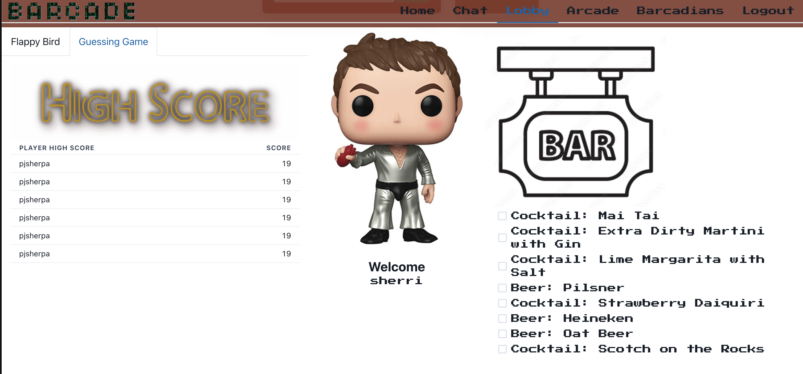
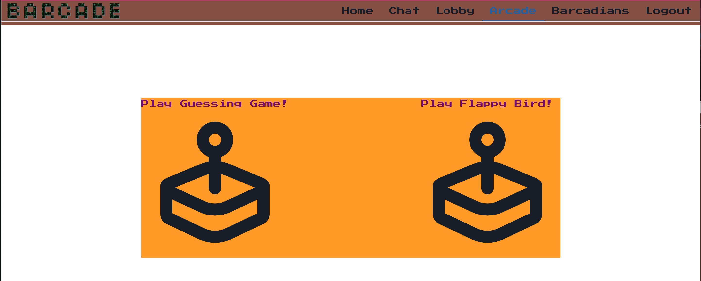

# 🥃 BARCADE 🕹

## This is the final group project for the UC Berkeley Fullstack Coding Boot Camp - Fall 2022 cohort

## The Team

- Cassie Kise
- Luan Pham
- Mike Rugh
- Pj Sherpa
- Sherri Knight

## Description

### Tired of not wanting to leave your house but still wanting to get drunk with your friends? Look no further, BARCADE is here for you. 🍺

<br>

### Featuring your favorite bartender with a selection of drinks, a group chat to check in with your palz, and most importantly games to play (and to beat your friends at). Unlike other game platforms, BARCADE gives you the collective analog computer gaming 👾 experience plus some social booze time. 🍸 Includes a main page group chat, bartender avatar, top score list, drink list, and multiple games for users to choose from.

<br>

## User Story

```
Our users are people who are waiting for their friends or want some source of entertainment / communicate with other users. A cloud based arcade where users can play various games, drink, chat, and compete for their highscores.
```

## TECH USED

- Chakra UI
- Heroku: 2nd repo for chat server
- socket.io (specifically use-socket.io-client)
- state--> useEffect, useState, and useImmer() (--> react hook)
- React
- JavaScript

## Links

- Deployed application: https://secure-everglades-09731.herokuapp.com
- Chat app Github Repository: https://github.com/cassandrakise/chat-for-barcade-app
- Github Repository: https://github.com/iamjoyfulgirl/barcade

## Screenshots

### Home


### Chat




### Lobby



### Arcade



### Games


---

## BARCADE 🍻 - Copyright 2022 Cassie Kise, Luan Pham, Mike Rugh, Pj Sherpa, Sherri Knight
